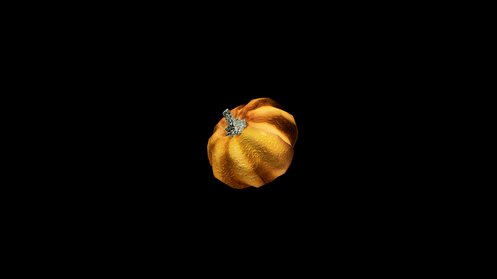

# Pumpkin

 It swells slowly in the field, drinking the long warmth of summer and the cooling breath of autumn, until it becomes a vessel of both plenty and protection. Farmers say a pumpkin left uncut will keep watch over a home, its quiet magic turning away hunger and ill fortune through the winter months.

## Item stats

  
Item stats

  <table>
    <tr><th>Weight</th><td>0.0</td></tr>
    <tr><th>Value</th><td>0.0</td></tr>
    <tr><th>Armor</th><td>0.0</td></tr>
  </table>

