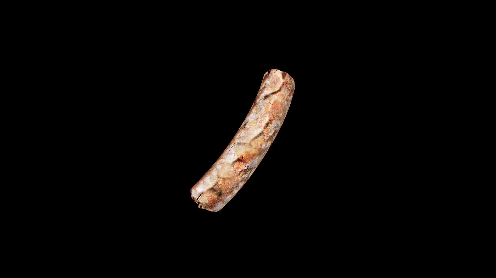

# Sausage

Meat, spice, and salt are sealed together within a casing like a spell knotted tight. Its flavor is deep and enduring, carrying the warmth of hearth smoke and the bite of whatever seasonings were worked into it. Travelers prize it for its long‑keeping strength, while soldiers carry it as a charm against hunger and fatigue on the march. In the hands of an alchemist‑cook, a sausage can be more than food—it can be a vessel for courage, vigor, or even protection.

## Item stats

  
Item stats

  <table>
    <tr><th>Weight</th><td>0.0</td></tr>
    <tr><th>Value</th><td>0.0</td></tr>
    <tr><th>Armor</th><td>0.0</td></tr>
  </table>

