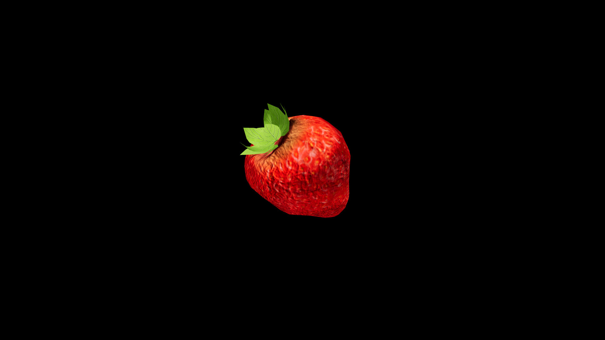

# Strawberry

Sweet, fragrant, and tender, it carries the warmth of the sun and the lightness of a breeze across flowering meadows. To taste it fresh from the vine is to taste joy itself, unshadowed and pure—yet in the hands of herbalists and alchemists, it becomes more than delight, serving as a gentle heart‑opener and a charm against sorrow.

## Item stats

  
Item stats

  <table>
    <tr><th>Weight</th><td>0.0</td></tr>
    <tr><th>Value</th><td>0.0</td></tr>
    <tr><th>Armor</th><td>0.0</td></tr>
  </table>

