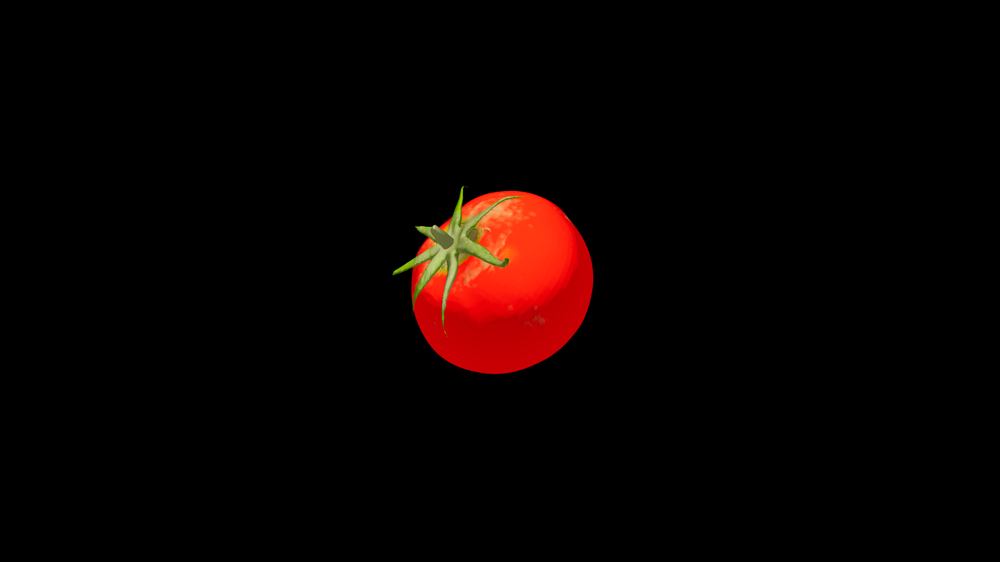

# Tomato

Plump and warm to the touch when freshly picked, it bursts with a rush of sweet‑tart juice that carries the memory of heat‑hazed afternoons and fertile soil. Some call it the “heartfruit,” for it is shaped like a promise—round, full, and brimming with life. Its magic is one of vitality and restoration, lending its warmth to both body and spirit.

## Item stats

  
Item stats

  <table>
    <tr><th>Weight</th><td>0.0</td></tr>
    <tr><th>Value</th><td>0.0</td></tr>
    <tr><th>Armor</th><td>0.0</td></tr>
  </table>

