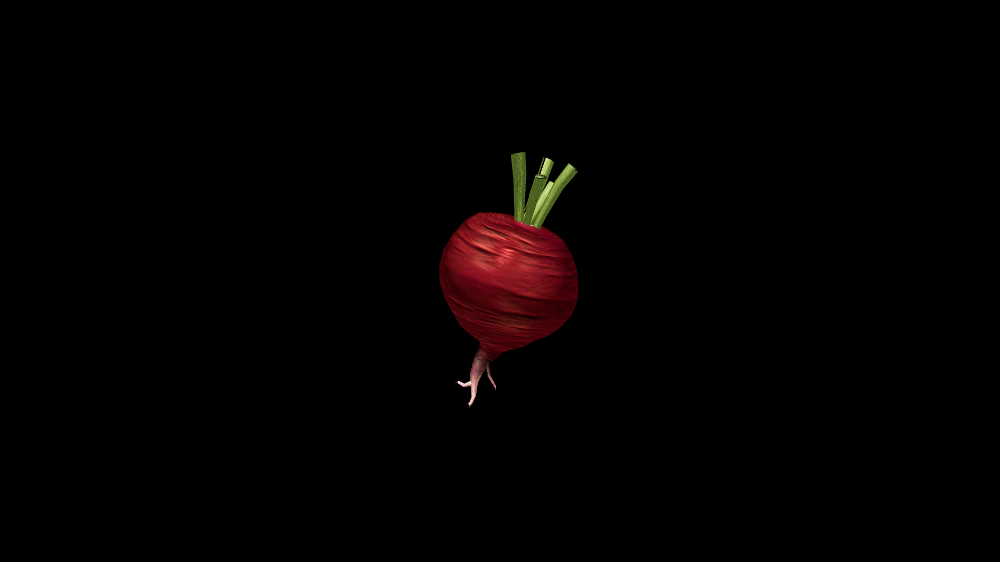

# Turnip

 Its flavor is sharp when raw, mellow when coaxed by fire, carrying the resilience of a root that thrives where others wither. Farmers prize it as a keeper of endurance—sustenance for long winters, and a reminder that even the humblest harvest can outlast hunger and hardship.

## Item stats

  
Item stats

  <table>
    <tr><th>Weight</th><td>0.0</td></tr>
    <tr><th>Value</th><td>0.0</td></tr>
    <tr><th>Armor</th><td>0.0</td></tr>
  </table>

