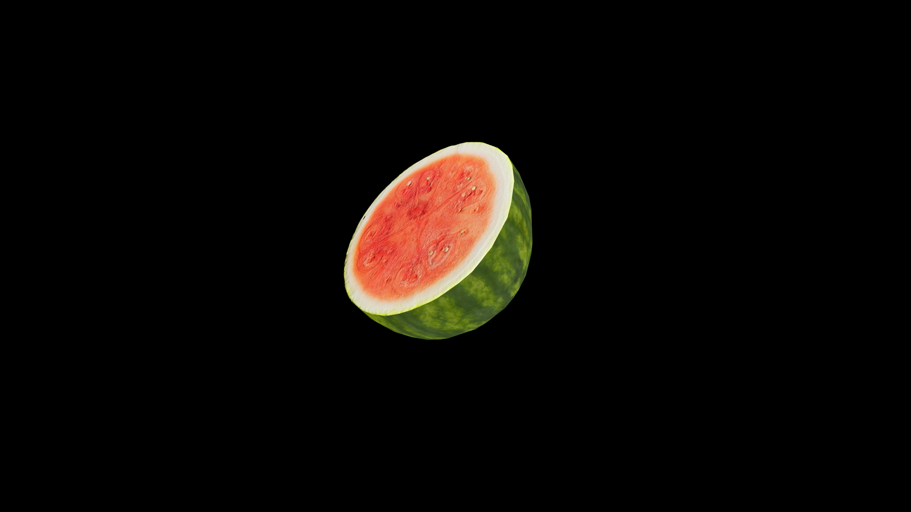

# Watermelon

Its thick, green rind hiding a cool ocean of crimson or pink, studded with black seeds like night scattered across day. Heavy in the arms and sweet on the tongue, it carries the magic of refreshment—quenching thirst, easing heat, and restoring strength as though the eater had drunk directly from a hidden spring. Farmers say it grows where joy has lingered in the soil, and that its roots drink more than water—they draw in laughter, sunlight, and the hum of cicadas.

## Item stats

  
Item stats

  <table>
    <tr><th>Weight</th><td>0.0</td></tr>
    <tr><th>Value</th><td>0.0</td></tr>
    <tr><th>Armor</th><td>0.0</td></tr>
  </table>

