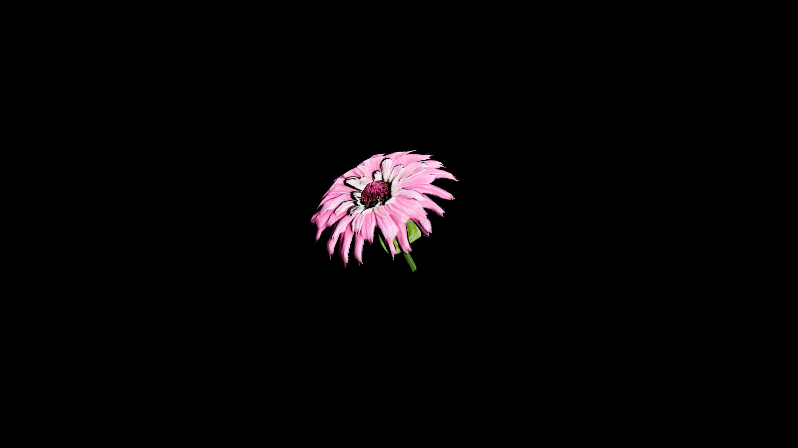

# Zinnia

Its petals hold the stubborn joy of late summer, standing tall against wind and weather, and its magic is one of endurance—of bonds kept alive across distance and time. To those who know the language of flowers, zinnia speaks of remembrance, loyalty, and the quiet promise that absence does not mean forgetting.

## Item stats

  
Item stats

  <table>
    <tr><th>Weight</th><td>0.0</td></tr>
    <tr><th>Value</th><td>0.0</td></tr>
    <tr><th>Armor</th><td>0.0</td></tr>
  </table>

