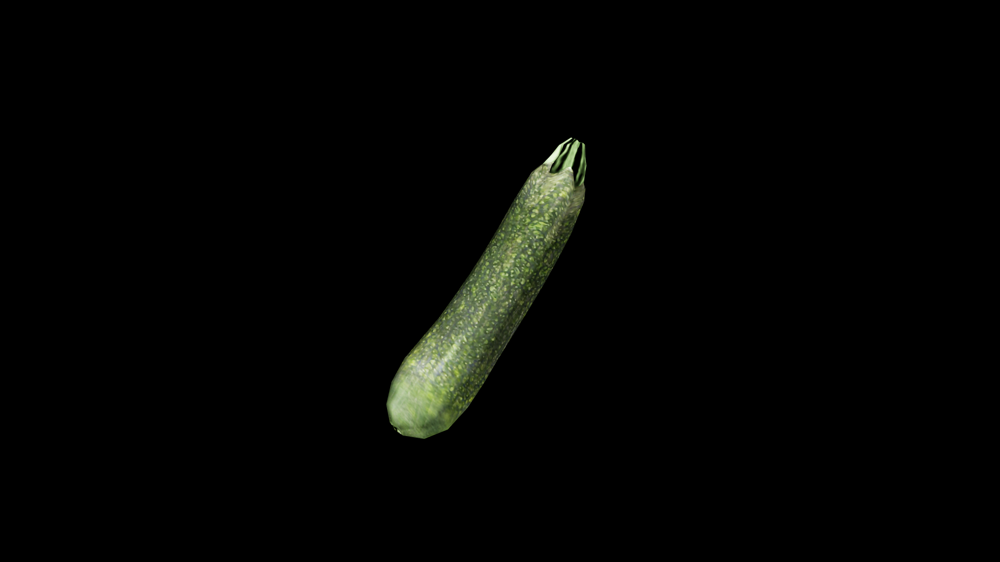

# Zucchini

Mild in flavor yet rich in vitality, it carries the magic of steady growth and adaptability—thriving in nearly any soil, flourishing with little care, and offering its bounty in abundance. To many herbalists, zucchini is a symbol of generosity and renewal, a plant that gives more than it takes.

## Item stats

  
Item stats

  <table>
    <tr><th>Weight</th><td>0.0</td></tr>
    <tr><th>Value</th><td>0.0</td></tr>
    <tr><th>Armor</th><td>0.0</td></tr>
  </table>

