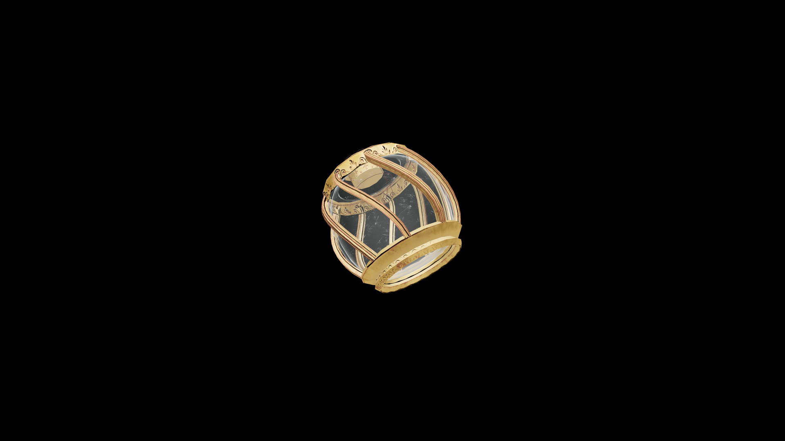

# Average Potion Of Fortify Destruction

A volatile mixture that hums with latent energy, this potion heightens the drinker’s mastery over destructive magic. Flames burn hotter, frost bites deeper, and lightning strikes with greater fury.

## Item stats

  
Item stats

  <table>
    <tr><th>Weight</th><td>1.0</td></tr>
    <tr><th>Value</th><td>35.0</td></tr>
  </table>

## Magic Effects

  
Magic Effects

  <ul>
    <li><a href="../../../Gameplay/MagicEffects/FortifyDestruction/">Fortify Destruction</a></li>
  </ul>

