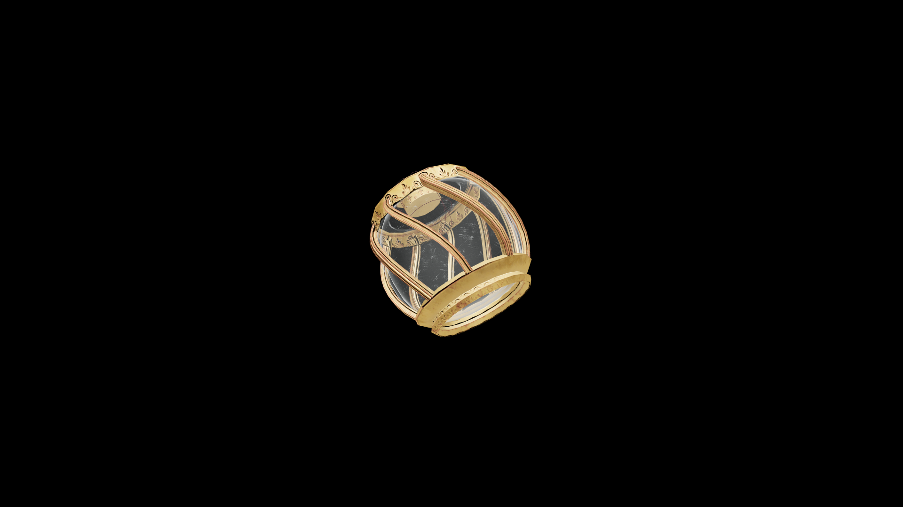

# Average Potion Of Fortify Enchanting

This radiant brew glimmers with a faint, shifting light, resonating with the essence of bound magic. Drinking it sharpens focus and deepens understanding of arcane imbuement, allowing the creation of stronger, longer-lasting enchantments.

## Item stats

  
Item stats

  <table>
    <tr><th>Weight</th><td>1.0</td></tr>
    <tr><th>Value</th><td>35.0</td></tr>
  </table>

## Magic Effects

  
Magic Effects

  <ul>
    <li><a href="../../../Gameplay/MagicEffects/FortifyEnchanting/">Fortify Enchanting</a></li>
  </ul>

