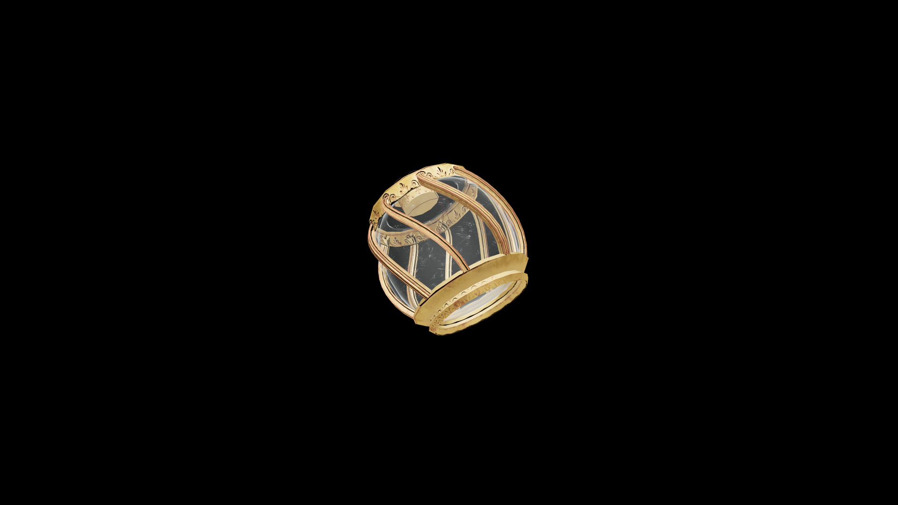

# Average Potion Of Fortify Illusion

A shimmering concoction that blurs at the edges when viewed too long. Drinking it deepens the drinker’s grasp of light, sound, and mind, empowering illusions to deceive, calm, or terrify with greater potency.

## Item stats

  
Item stats

  <table>
    <tr><th>Weight</th><td>1.0</td></tr>
    <tr><th>Value</th><td>35.0</td></tr>
  </table>

## Magic Effects

  
Magic Effects

  <ul>
    <li><a href="../../../Gameplay/MagicEffects/FortifyIllusion/">Fortify Illusion</a></li>
  </ul>

