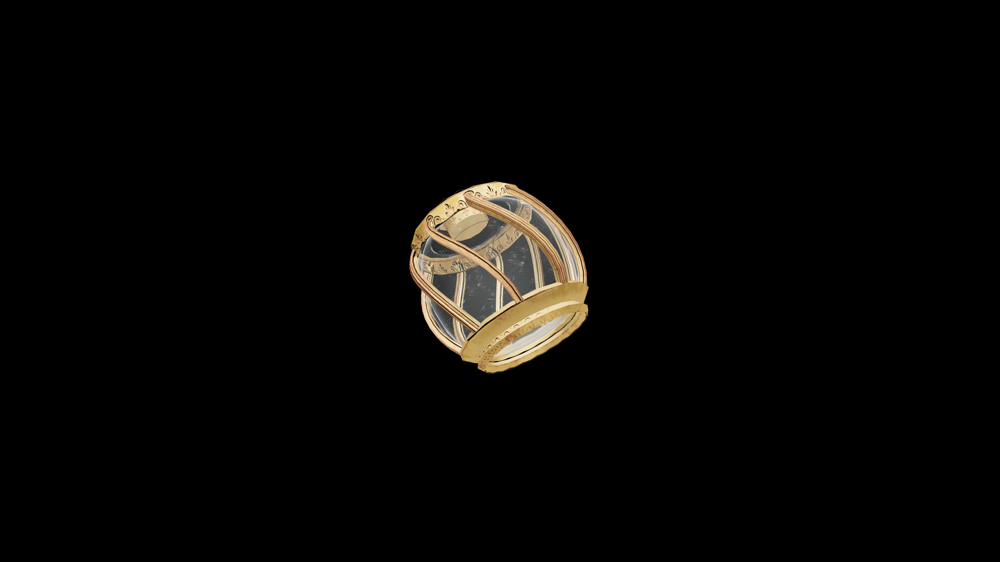

# Average Potion Of Fortify Light Armor

A bright, invigorating potion that fills the body with agility and poise. The drinker moves with effortless grace, turning aside blows and flowing through combat as lightly as air.

## Item stats

  
Item stats

  <table>
    <tr><th>Weight</th><td>1.0</td></tr>
    <tr><th>Value</th><td>35.0</td></tr>
  </table>

## Magic Effects

  
Magic Effects

  <ul>
    <li><a href="../../../Gameplay/MagicEffects/FortifyLightArmor/">Fortify Light Armor</a></li>
  </ul>

