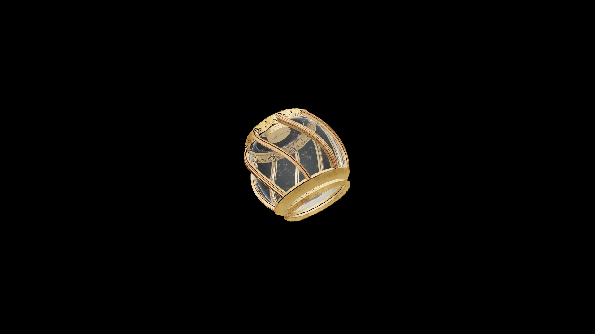

# Average Potion Of Fortify Sneak

A cool, shadowy elixir that seems to dim the air around it. Once consumed, the drinker’s steps grow lighter and movements more fluid, blending seamlessly into the stillness of their surroundings.

## Item stats

  
Item stats

  <table>
    <tr><th>Weight</th><td>1.0</td></tr>
    <tr><th>Value</th><td>35.0</td></tr>
  </table>

## Magic Effects

  
Magic Effects

  <ul>
    <li><a href="../../../Gameplay/MagicEffects/FortifySneak/">Fortify Sneak</a></li>
  </ul>

