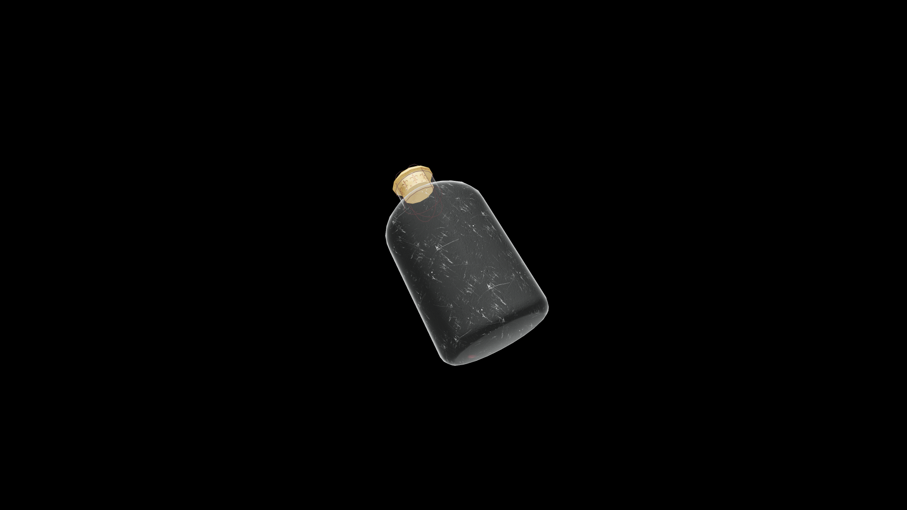

# Average Potion Of Fortify Speed

A light, energizing potion that crackles faintly when uncorked. Once consumed, it floods the body with vigor and sharpens reflexes, letting the drinker move with blinding quickness and effortless agility.

## Item stats

  
Item stats

  <table>
    <tr><th>Weight</th><td>1.0</td></tr>
    <tr><th>Value</th><td>35.0</td></tr>
  </table>

## Magic Effects

  
Magic Effects

  <ul>
    <li><a href="../../../Gameplay/MagicEffects/FortifySpeed/">Fortify Speed</a></li>
  </ul>

