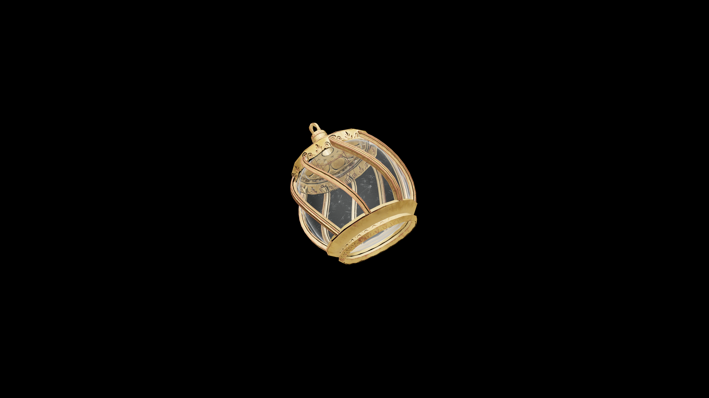

# Average Potion Of Restore Blunt

Drinking it rekindles a warrior’s rhythm, restoring confidence and stamina in the use of blunt weapons and the strength that drives them.

## Item stats

  
Item stats

  <table>
    <tr><th>Weight</th><td>1.0</td></tr>
    <tr><th>Value</th><td>35.0</td></tr>
  </table>

## Magic Effects

  
Magic Effects

  <ul>
    <li><a href="../../../Gameplay/MagicEffects/RestoreBlunt/">Restore Blunt</a></li>
  </ul>

