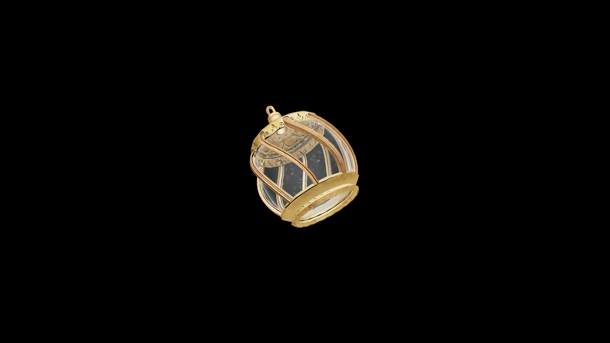

# Average Potion Of Restore Enchanting

Upon drinking, it restores clarity and control to the mind, renewing one’s ability to weave enchantments and bind power into form once again.

## Item stats

  
Item stats

  <table>
    <tr><th>Weight</th><td>1.0</td></tr>
    <tr><th>Value</th><td>35.0</td></tr>
  </table>

## Magic Effects

  
Magic Effects

  <ul>
    <li><a href="../../../Gameplay/MagicEffects/RestoreEnchanting/">Restore Enchanting</a></li>
  </ul>

