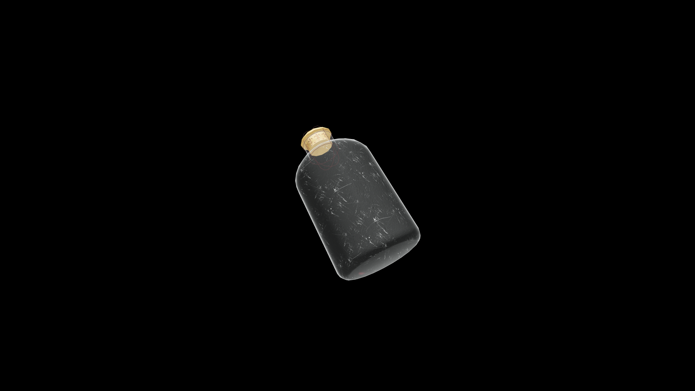

# Average Potion Of Restore Endurance

Drinking it soothes weary muscles and renews inner fortitude, restoring stamina and resilience to those worn thin by battle or travel.

## Item stats

  
Item stats

  <table>
    <tr><th>Weight</th><td>1.0</td></tr>
    <tr><th>Value</th><td>35.0</td></tr>
  </table>

## Magic Effects

  
Magic Effects

  <ul>
    <li><a href="../../../Gameplay/MagicEffects/RestoreEndurance/">Restore Endurance</a></li>
  </ul>

