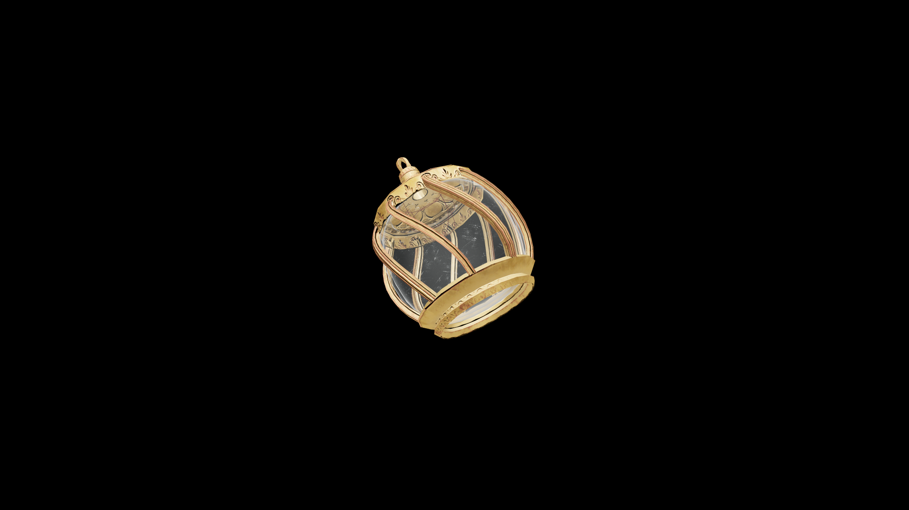

# Average Potion Of Restore Illusion

When consumed, it restores the drinker’s subtle command of perception, renewing their ability to weave light, sound, and emotion into perfect deception.

## Item stats

  
Item stats

  <table>
    <tr><th>Weight</th><td>1.0</td></tr>
    <tr><th>Value</th><td>35.0</td></tr>
  </table>

## Magic Effects

  
Magic Effects

  <ul>
    <li><a href="../../../Gameplay/MagicEffects/RestoreIllusion/">Restore Illusion</a></li>
  </ul>

