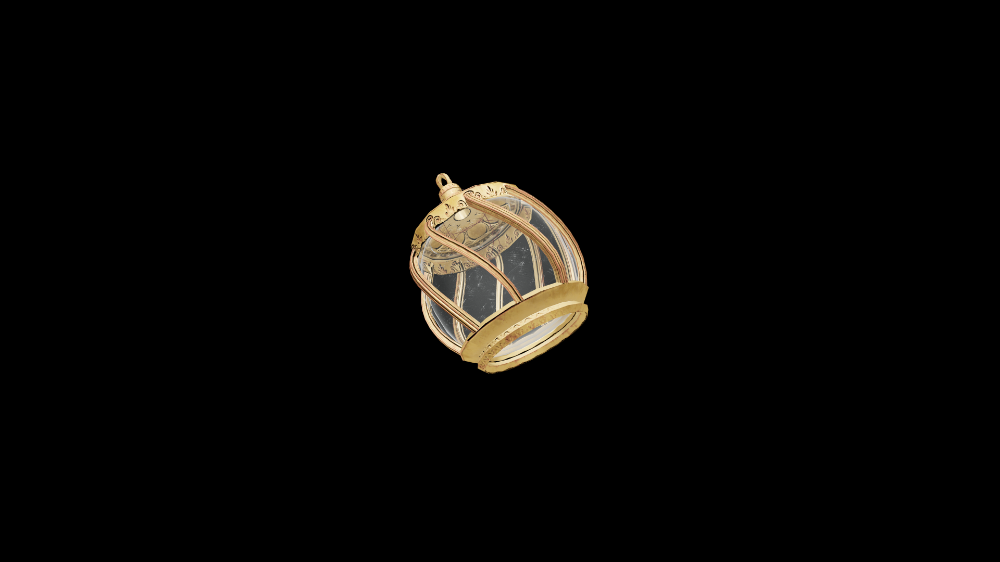

# Average Potion Of Restore Mercantile

Drinking it renews clarity and confidence, restoring one’s instinct for trade and the charm that turns every bargain to advantage.

## Item stats

  
Item stats

  <table>
    <tr><th>Weight</th><td>1.0</td></tr>
    <tr><th>Value</th><td>35.0</td></tr>
  </table>

## Magic Effects

  
Magic Effects

  <ul>
    <li><a href="../../../Gameplay/MagicEffects/RestoreMercantile/">Restore Mercantile</a></li>
  </ul>

