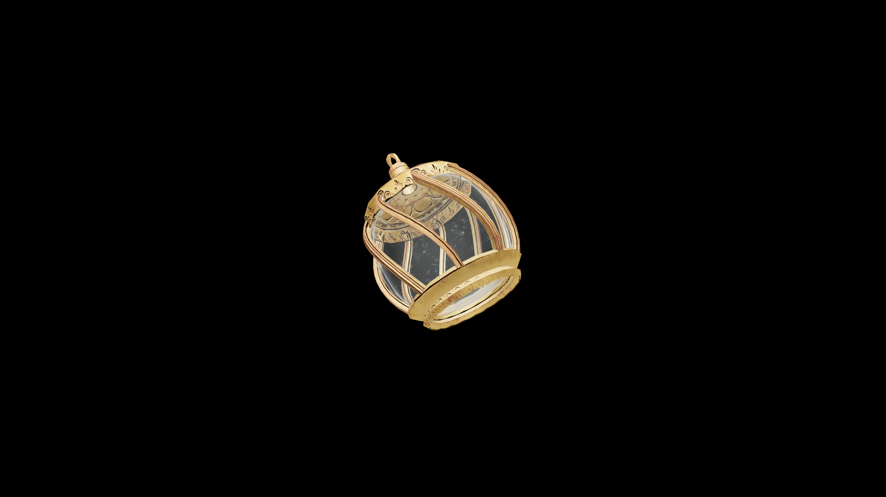

# Average Potion Of Restore Restoration

When consumed, it renews the drinker’s connection to healing magic, restoring balance and focus to the hands that mend and the heart that guides them.

## Item stats

  
Item stats

  <table>
    <tr><th>Weight</th><td>1.0</td></tr>
    <tr><th>Value</th><td>35.0</td></tr>
  </table>

## Magic Effects

  
Magic Effects

  <ul>
    <li><a href="../../../Gameplay/MagicEffects/RestoreRestoration/">Restore Restoration</a></li>
  </ul>

