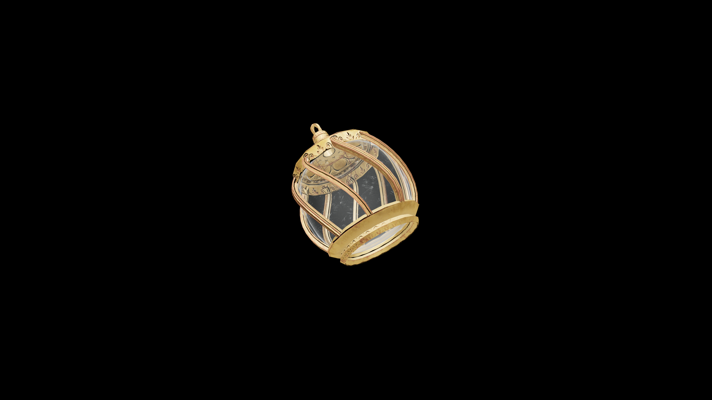

# Average Potion Of Restore Wand

This potion restores the steadiness and focus required to channel power through a wand. It renews precision and flow, allowing magic to once again respond faithfully to the caster’s intent.

## Item stats

  
Item stats

  <table>
    <tr><th>Weight</th><td>1.0</td></tr>
    <tr><th>Value</th><td>35.0</td></tr>
  </table>

## Magic Effects

  
Magic Effects

  <ul>
    <li><a href="../../../Gameplay/MagicEffects/RestoreWand/">Restore Wand</a></li>
  </ul>

