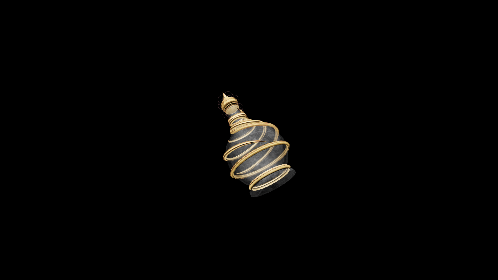

# Master Potion Of Fortify Destruction

A formidable potion that amplifies the drinker’s command of destructive magic. Energy flows more freely, and elemental power strikes with devastating precision, reducing all who oppose you to ash, ice, or silence.

## Item stats

  
Item stats

  <table>
    <tr><th>Weight</th><td>1.0</td></tr>
    <tr><th>Value</th><td>125. 0</td></tr>
  </table>

## Magic Effects

  
Magic Effects

  <ul>
    <li><a href="../../../Gameplay/MagicEffects/FortifyDestruction/">Fortify Destruction</a></li>
  </ul>

