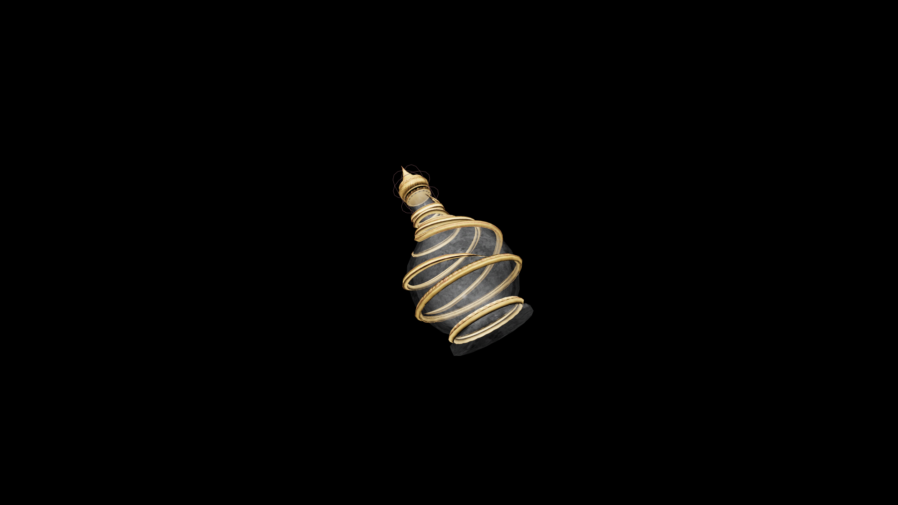

# Master Potion Of Restore Alteration

An expertly brewed potion that replenishes understanding of natural law and transformation. It restores command over the forces that shape the physical world to the caster’s will.

## Item stats

  
Item stats

  <table>
    <tr><th>Weight</th><td>1.0</td></tr>
    <tr><th>Value</th><td>125. 0</td></tr>
  </table>

## Magic Effects

  
Magic Effects

  <ul>
    <li><a href="../../../Gameplay/MagicEffects/RestoreAlteration/">Restore Alteration</a></li>
  </ul>

