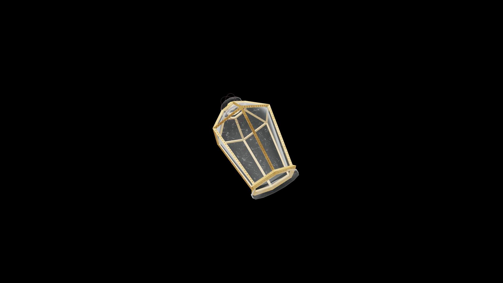

# Strong Potion Of Fortify Destruction

This vigorous elixir heightens command over destructive magic, refining control without dulling power. Flames burn cleaner, frost cuts sharper, and lightning strikes with disciplined fury.

## Item stats

  
Item stats

  <table>
    <tr><th>Weight</th><td>1.0</td></tr>
    <tr><th>Value</th><td>60. 0</td></tr>
  </table>

## Magic Effects

  
Magic Effects

  <ul>
    <li><a href="../../../Gameplay/MagicEffects/FortifyDestruction/">Fortify Destruction</a></li>
  </ul>

