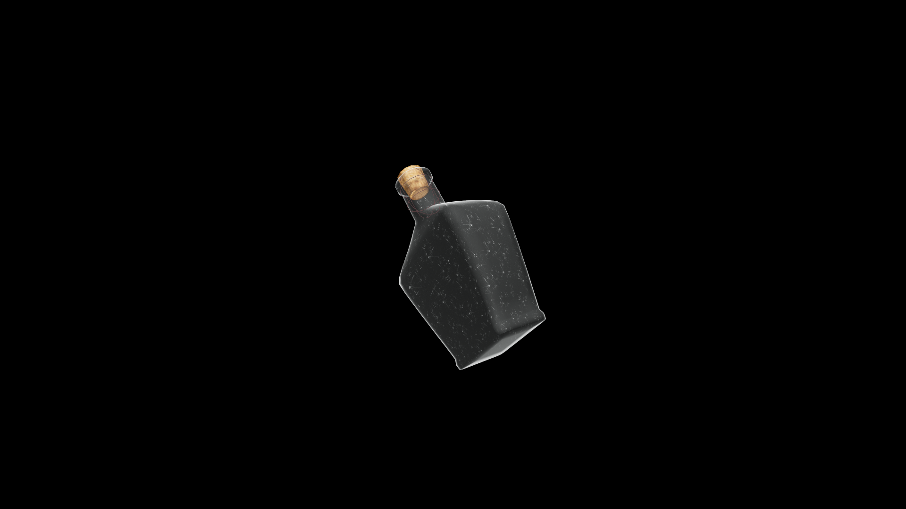

# Strong Potion Of Restore Magic

A concentrated restorative that replenishes the drinker’s magical reserves. It restores clarity and control, allowing energy to flow freely once more through the channels of will and focus.

## Item stats

  
Item stats

  <table>
    <tr><th>Weight</th><td>1.0</td></tr>
    <tr><th>Value</th><td>60. 0</td></tr>
  </table>

## Magic Effects

  
Magic Effects

  <ul>
    <li><a href="../../../Gameplay/MagicEffects/RestoreMagic/">Restore Magic</a></li>
  </ul>

