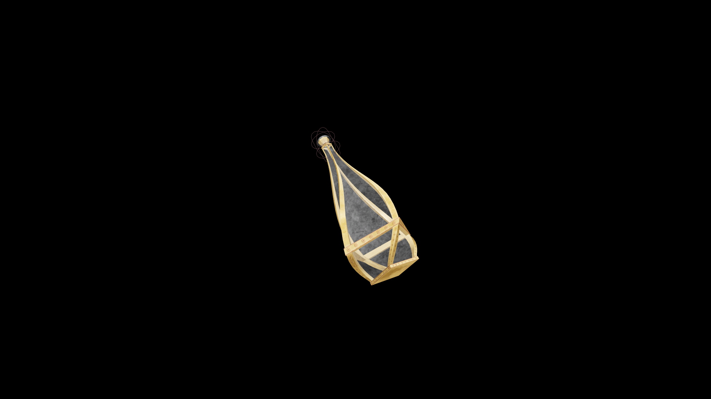

# Very Strong Potion Of Fortify Light Armor

This agile potion restores grace and control to movement, enhancing the bond between motion and defense. It allows the wearer to move with both speed and stability, flowing seamlessly through combat.

## Item stats

  
Item stats

  <table>
    <tr><th>Weight</th><td>1.0</td></tr>
    <tr><th>Value</th><td>90. 0</td></tr>
  </table>

## Magic Effects

  
Magic Effects

  <ul>
    <li><a href="../../../Gameplay/MagicEffects/FortifyLightArmor/">Fortify Light Armor</a></li>
  </ul>

