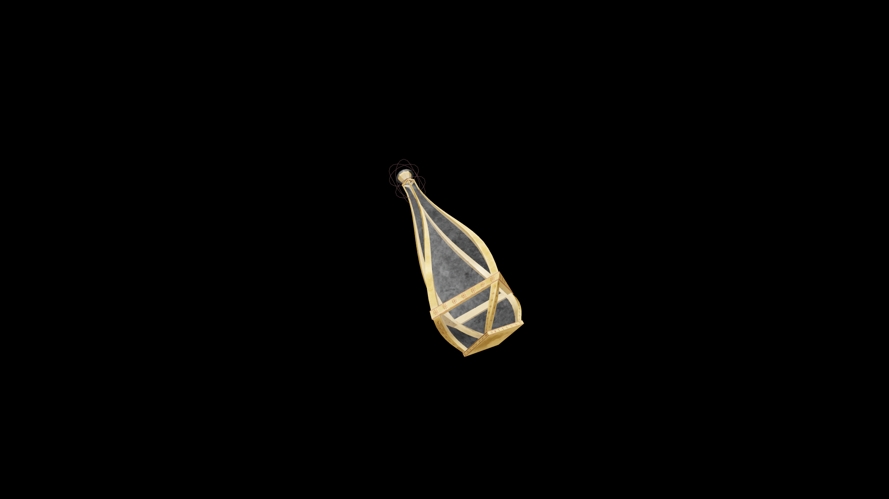

# Very Strong Potion Of Restore Mercantile

A composed restorative that renews confidence and perception in trade. It restores focus, patience, and intuition, allowing the drinker to once again recognize opportunity with clarity.

## Item stats

  
Item stats

  <table>
    <tr><th>Weight</th><td>1.0</td></tr>
    <tr><th>Value</th><td>90. 0</td></tr>
  </table>

## Magic Effects

  
Magic Effects

  <ul>
    <li><a href="../../../Gameplay/MagicEffects/RestoreMercantile/">Restore Mercantile</a></li>
  </ul>

