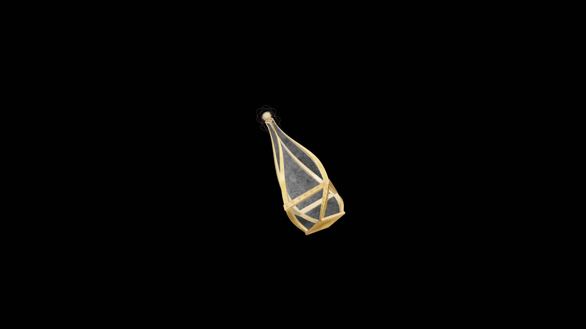

# Very Strong Potion Of Restore Unarmored

A focused restorative that renews agility and awareness in combat. It restores balance and control to the unarmored fighter, allowing instinct and motion to flow in perfect unison once again.

## Item stats

  
Item stats

  <table>
    <tr><th>Weight</th><td>1.0</td></tr>
    <tr><th>Value</th><td>90. 0</td></tr>
  </table>

## Magic Effects

  
Magic Effects

  <ul>
    <li><a href="../../../Gameplay/MagicEffects/RestoreUnarmored/">Restore Unarmored</a></li>
  </ul>

