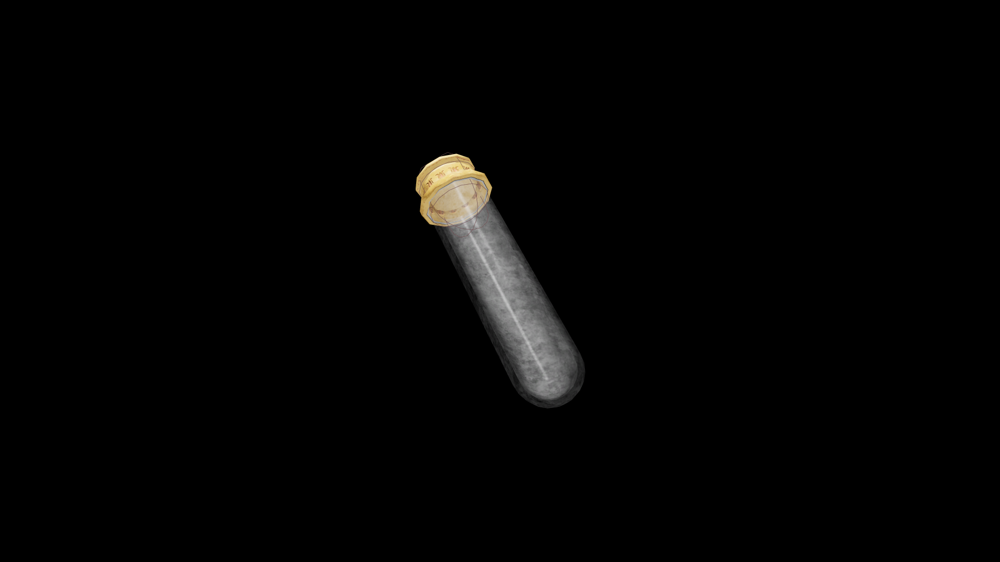

# Very Weak Potion Of Fortify Destruction

This modest elixir enhances concentration and helps new casters find control in their spellwork. It offers a gentle increase in destructive power while preserving balance and restraint.

## Item stats

  
Item stats

  <table>
    <tr><th>Weight</th><td>1.0</td></tr>
    <tr><th>Value</th><td>15. 0</td></tr>
  </table>

## Magic Effects

  
Magic Effects

  <ul>
    <li><a href="../../../Gameplay/MagicEffects/FortifyDestruction/">Fortify Destruction</a></li>
  </ul>

