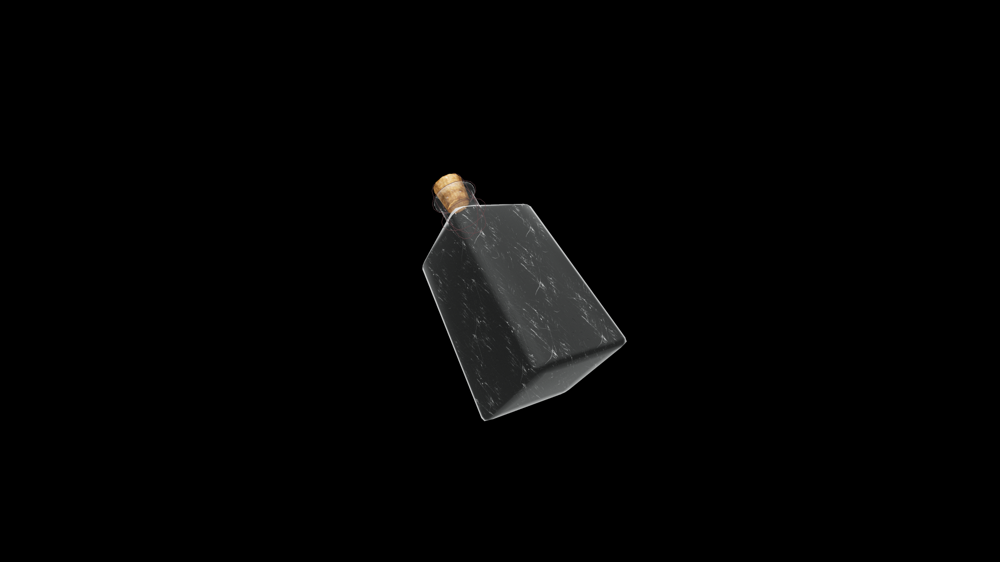

# Very Weak Potion Of Fortify Magic

A simple yet reliable potion that gently strengthens the flow of magical energy within the drinker. It provides a slight increase to Magicka reserves, helping new casters extend their practice.

## Item stats

  
Item stats

  <table>
    <tr><th>Weight</th><td>1.0</td></tr>
    <tr><th>Value</th><td>15. 0</td></tr>
  </table>

## Magic Effects

  
Magic Effects

  <ul>
    <li><a href="../../../Gameplay/MagicEffects/FortifyMagic/">Fortify Magic</a></li>
  </ul>

