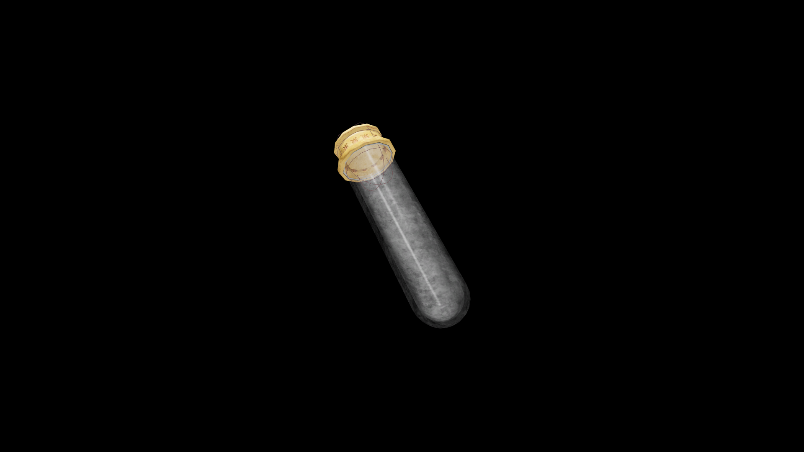

# Very Weak Potion Of Fortify Repair

A simple potion that steadies the hands and clears the mind of a new craftsman. It grants a small boost to focus and precision, helping even a novice perform careful, lasting repairs.

## Item stats

  
Item stats

  <table>
    <tr><th>Weight</th><td>1.0</td></tr>
    <tr><th>Value</th><td>15. 0</td></tr>
  </table>

## Magic Effects

  
Magic Effects

  <ul>
    <li><a href="../../../Gameplay/MagicEffects/FortifyRepair/">Fortify Repair</a></li>
  </ul>

