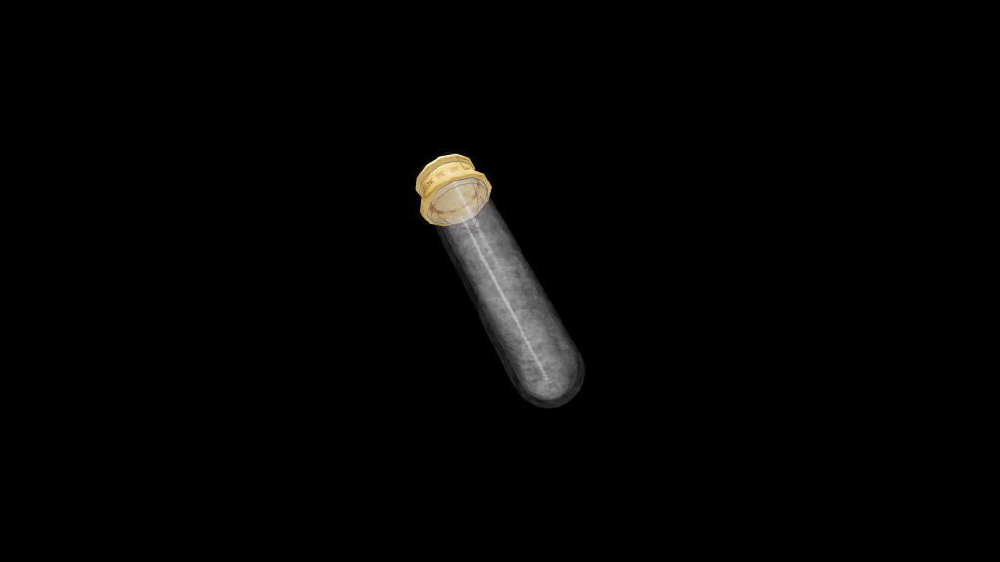

# Very Weak Potion Of Fortify Unarmored

A beginner’s brew that lightly sharpens reflexes and awareness. It helps new fighters trust their movements and maintain balance without relying on armor for protection.

## Item stats

  
Item stats

  <table>
    <tr><th>Weight</th><td>1.0</td></tr>
    <tr><th>Value</th><td>15. 0</td></tr>
  </table>

## Magic Effects

  
Magic Effects

  <ul>
    <li><a href="../../../Gameplay/MagicEffects/FortifyUnarmored/">Fortify Unarmored</a></li>
  </ul>

