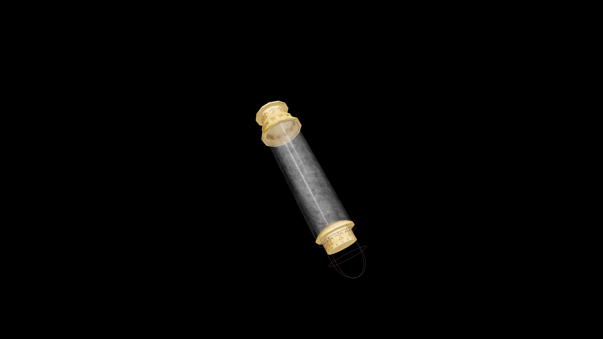

# Very Weak Potion Of Restore Alteration

This simple brew renews a beginner’s sense of focus and curiosity. It restores a touch of understanding to the balance and transformation at the heart of Alteration magic.

## Item stats

  
Item stats

  <table>
    <tr><th>Weight</th><td>1.0</td></tr>
    <tr><th>Value</th><td>15. 0</td></tr>
  </table>

## Magic Effects

  
Magic Effects

  <ul>
    <li><a href="../../../Gameplay/MagicEffects/RestoreAlteration/">Restore Alteration</a></li>
  </ul>

