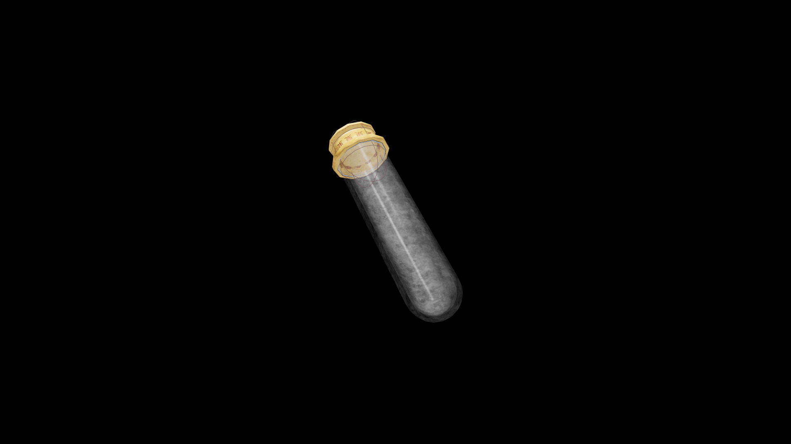

# Very Weak Potion Of Restore Block

This mild potion restores composure and steadiness in defense. It helps beginners regain their rhythm, allowing them to meet each strike with growing assurance.

## Item stats

  
Item stats

  <table>
    <tr><th>Weight</th><td>1.0</td></tr>
    <tr><th>Value</th><td>15. 0</td></tr>
  </table>

## Magic Effects

  
Magic Effects

  <ul>
    <li><a href="../../../Gameplay/MagicEffects/RestoreBlock/">Restore Block</a></li>
  </ul>

