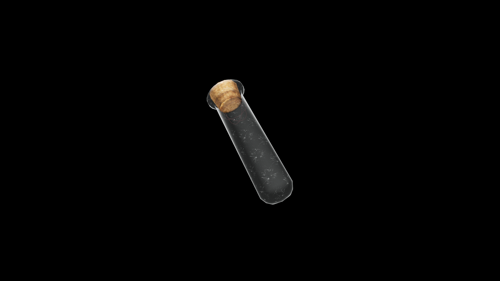

# Very Weak Potion Of Restore Health

A gentle brew that soothes aches and restores a touch of strength. It heals minor wounds and renews the body’s energy, offering comfort to those just starting their journey.

## Item stats

  
Item stats

  <table>
    <tr><th>Weight</th><td>1.0</td></tr>
    <tr><th>Value</th><td>15. 0</td></tr>
  </table>

## Magic Effects

  
Magic Effects

  <ul>
    <li><a href="../../../Gameplay/MagicEffects/RestoreHealth/">Restore Health</a></li>
  </ul>

