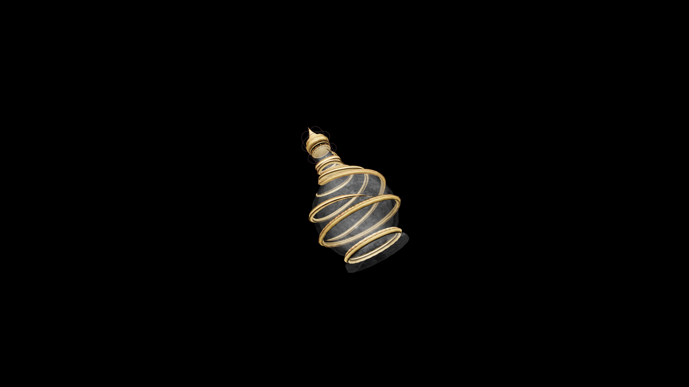

# Very Weak Potion Of Restore Heavy Armor

This simple restorative helps new defenders regain their footing under the weight of armor. It returns a small measure of endurance and control, easing each movement back into rhythm.

## Item stats

  
Item stats

  <table>
    <tr><th>Weight</th><td>1.0</td></tr>
    <tr><th>Value</th><td>15. 0</td></tr>
  </table>

## Magic Effects

  
Magic Effects

  <ul>
    <li><a href="../../../Gameplay/MagicEffects/RestoreHeavyArmor/">Restore Heavy Armor</a></li>
  </ul>

