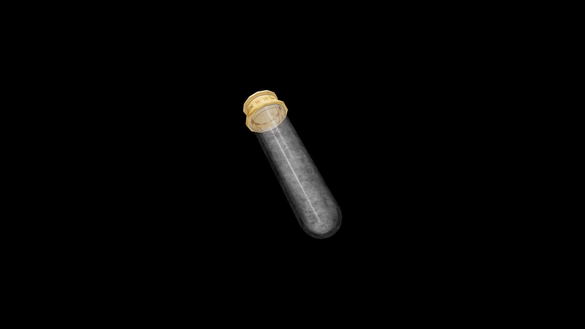

# Very Weak Potion Of Restore Unarmored

This light restorative renews balance and awareness. It helps the unarmored fighter regain trust in movement, reminding them that defense lies in precision, not protection.

## Item stats

  
Item stats

  <table>
    <tr><th>Weight</th><td>1.0</td></tr>
    <tr><th>Value</th><td>15. 0</td></tr>
  </table>

## Magic Effects

  
Magic Effects

  <ul>
    <li><a href="../../../Gameplay/MagicEffects/RestoreUnarmored/">Restore Unarmored</a></li>
  </ul>

