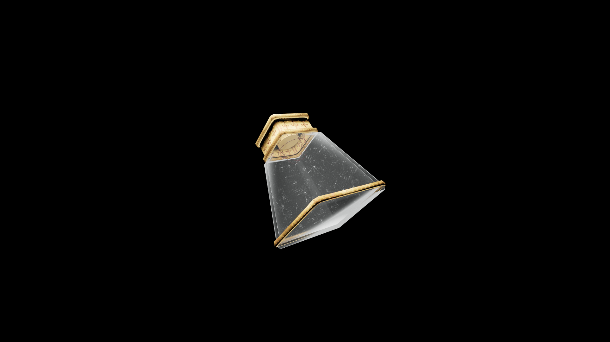

# Weak Potion Of Fortify Enchanting

A steady potion that renews patience and focus. It strengthens the enchanter’s awareness of magical flow, allowing energy to bind more cleanly and consistently to their craft.

## Item stats

  
Item stats

  <table>
    <tr><th>Weight</th><td>1.0</td></tr>
    <tr><th>Value</th><td>25. 0</td></tr>
  </table>

## Magic Effects

  
Magic Effects

  <ul>
    <li><a href="../../../Gameplay/MagicEffects/FortifyEnchanting/">Fortify Enchanting</a></li>
  </ul>

