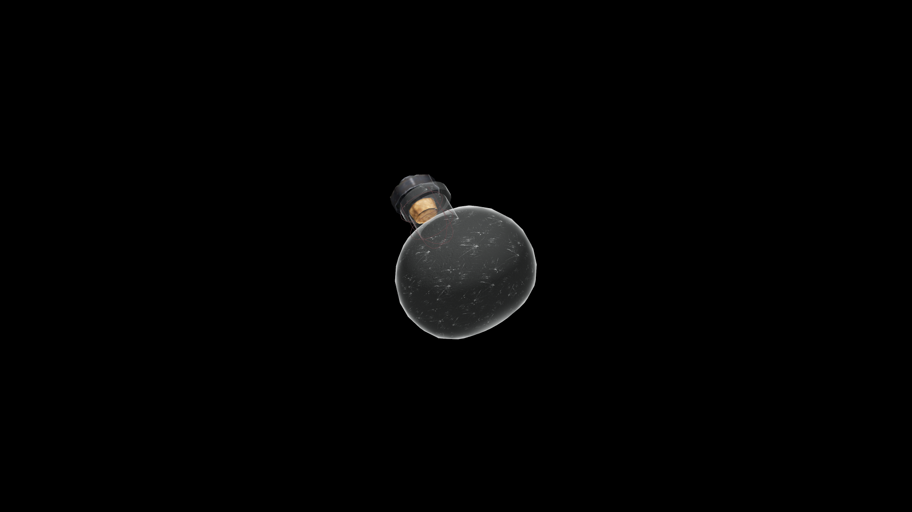

# Very Weak Potion Of Fortify Health

This hearty potion restores vigor and stability. It reinforces the drinker’s natural endurance, offering a steady sense of renewal and lasting strength.

## Item stats

  
Item stats

  <table>
    <tr><th>Weight</th><td>1.0</td></tr>
    <tr><th>Value</th><td>25. 0</td></tr>
  </table>

## Magic Effects

  
Magic Effects

  <ul>
    <li><a href="../../../Gameplay/MagicEffects/FortifyHealth/">Fortify Health</a></li>
  </ul>

