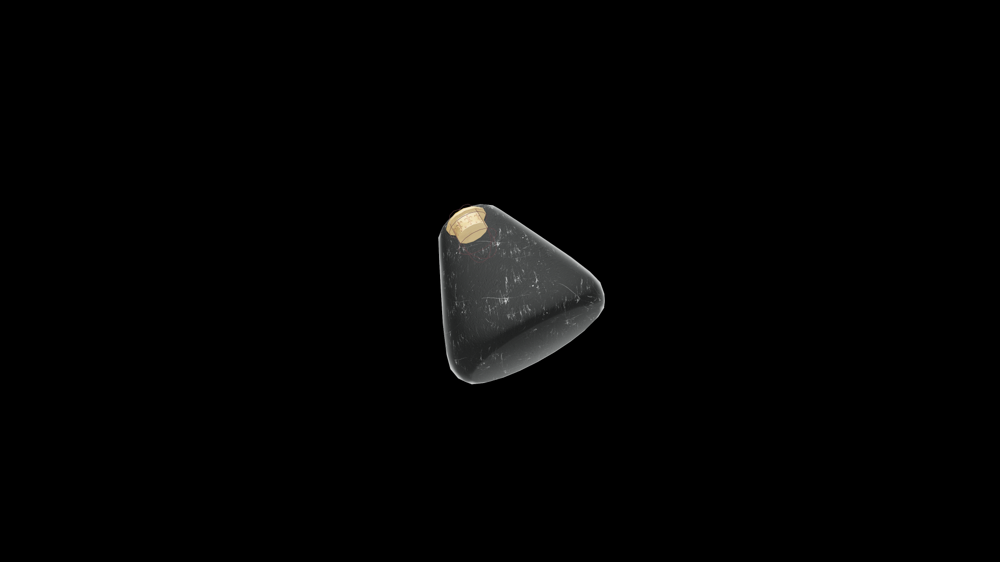

# Weak Potion Of Fortify Light Armor

This nimble tonic heightens coordination and agility. It supports smooth, practiced movement, allowing lighter armor to serve as an extension of the body’s rhythm.

## Item stats

  
Item stats

  <table>
    <tr><th>Weight</th><td>1.0</td></tr>
    <tr><th>Value</th><td>25. 0</td></tr>
  </table>

## Magic Effects

  
Magic Effects

  <ul>
    <li><a href="../../../Gameplay/MagicEffects/FortifyLightArmor/">Fortify Light Armor</a></li>
  </ul>

