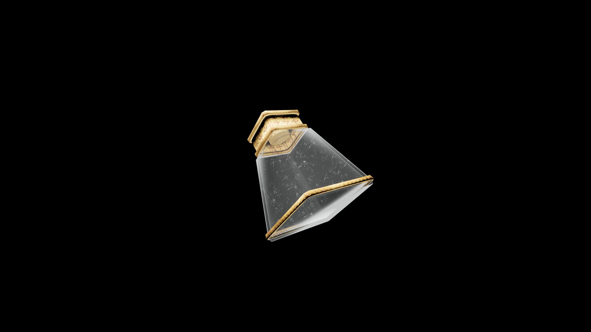

# Weak Potion Of Fortify Long Blade

A dependable potion that refines timing and control in swordplay. It strengthens balance and awareness, helping each strike flow smoothly from practiced precision.

## Item stats

  
Item stats

  <table>
    <tr><th>Weight</th><td>1.0</td></tr>
    <tr><th>Value</th><td>25. 0</td></tr>
  </table>

## Magic Effects

  
Magic Effects

  <ul>
    <li><a href="../../../Gameplay/MagicEffects/FortifyLongBlade/">Fortify Long Blade</a></li>
  </ul>

