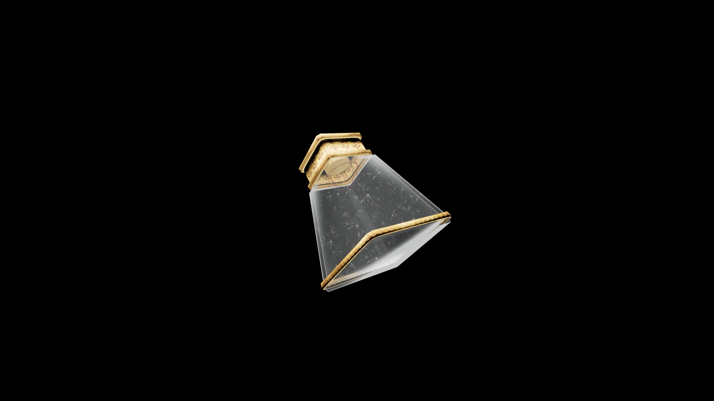

# Weak Potion Of Fortify Short Blade

A light potion that enhances precision and timing. It steadies the hand and sharpens awareness, helping the wielder move with confidence and control in close combat.

## Item stats

  
Item stats

  <table>
    <tr><th>Weight</th><td>1.0</td></tr>
    <tr><th>Value</th><td>25. 0</td></tr>
  </table>

## Magic Effects

  
Magic Effects

  <ul>
    <li><a href="../../../Gameplay/MagicEffects/FortifyShortBlade/">Fortify Short Blade</a></li>
  </ul>

