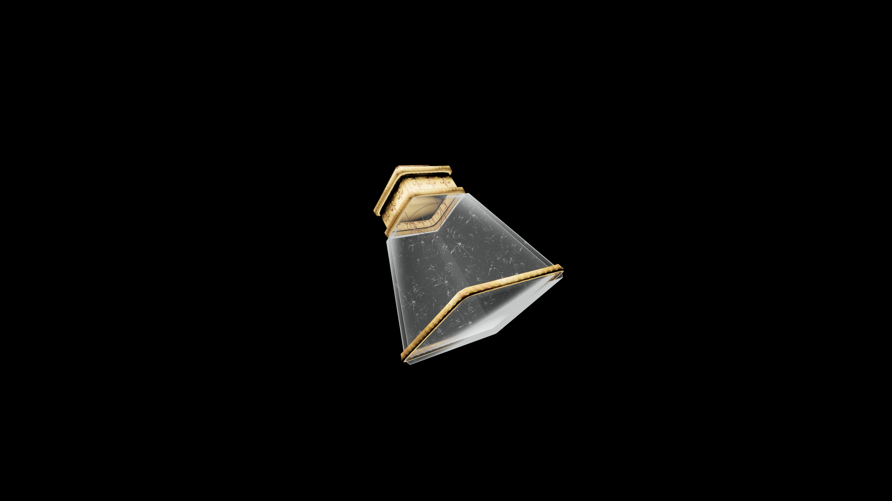

# Weak Potion Of Restore Enchanting

This carefully crafted tonic restores the clarity and composure needed for enchanting. It renews attention to detail, allowing magic to bind once more with strength and stability.

## Item stats

  
Item stats

  <table>
    <tr><th>Weight</th><td>1.0</td></tr>
    <tr><th>Value</th><td>25. 0</td></tr>
  </table>

## Magic Effects

  
Magic Effects

  <ul>
    <li><a href="../../../Gameplay/MagicEffects/RestoreEnchanting/">Restore Enchanting</a></li>
  </ul>

