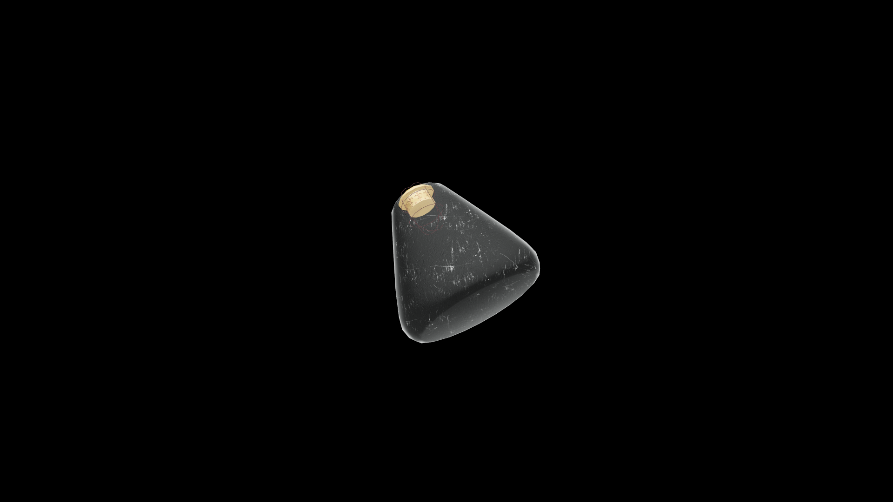

# Weak Potion Of Restore Endurance

A hearty tonic that restores stamina and steadiness. It renews the body’s rhythm and resolve, allowing the drinker to press on with balanced strength and focus.

## Item stats

  
Item stats

  <table>
    <tr><th>Weight</th><td>1.0</td></tr>
    <tr><th>Value</th><td>25. 0</td></tr>
  </table>

## Magic Effects

  
Magic Effects

  <ul>
    <li><a href="../../../Gameplay/MagicEffects/RestoreEndurance/">Restore Endurance</a></li>
  </ul>

