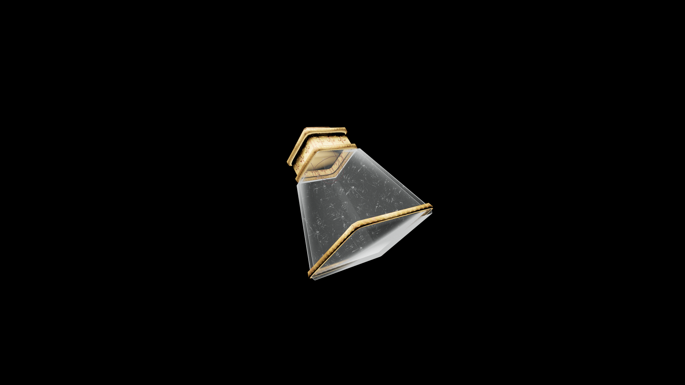

# Weak Potion Of Restore Illusion

A subtle restorative that renews perception and focus. It restores the calm awareness needed to shape thought and light, allowing Illusion spells to weave smoothly once again.

## Item stats

  
Item stats

  <table>
    <tr><th>Weight</th><td>1.0</td></tr>
    <tr><th>Value</th><td>25. 0</td></tr>
  </table>

## Magic Effects

  
Magic Effects

  <ul>
    <li><a href="../../../Gameplay/MagicEffects/RestoreIllusion/">Restore Illusion</a></li>
  </ul>

