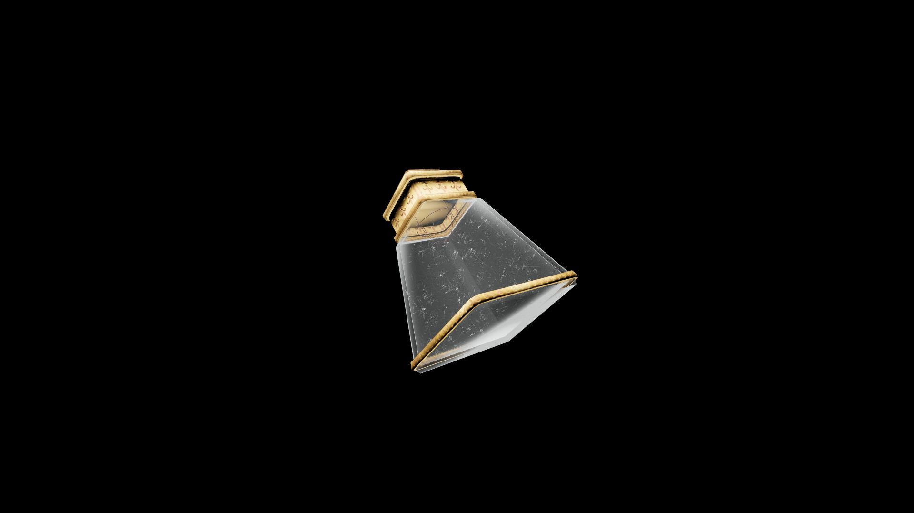

# Weak Potion Of Restore Light Armor

A light, refreshing potion that restores agility and balance. It helps the drinker regain coordination and confidence, allowing smooth and practiced movement in battle.

## Item stats

  
Item stats

  <table>
    <tr><th>Weight</th><td>1.0</td></tr>
    <tr><th>Value</th><td>25. 0</td></tr>
  </table>

## Magic Effects

  
Magic Effects

  <ul>
    <li><a href="../../../Gameplay/MagicEffects/RestoreLightArmor/">Restore Light Armor</a></li>
  </ul>

