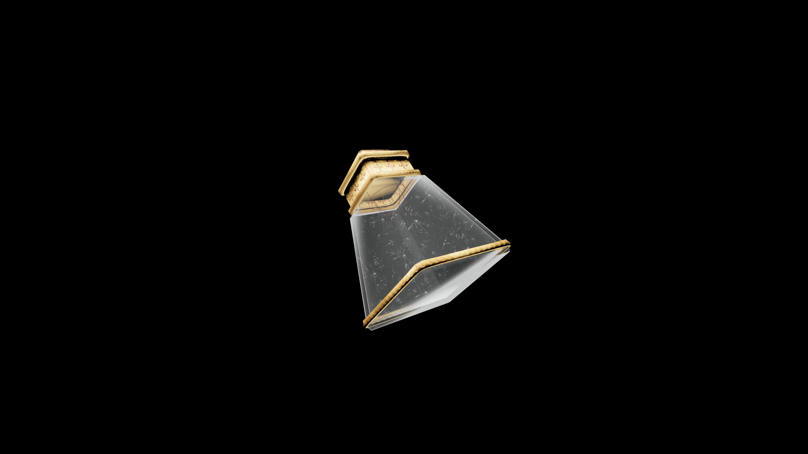

# Weak Potion Of Restore Long Blade

This reliable tonic restores control and precision in swordplay. It brings back timing and steadiness, letting the blade once again follow the intent of the hand.

## Item stats

  
Item stats

  <table>
    <tr><th>Weight</th><td>1.0</td></tr>
    <tr><th>Value</th><td>25. 0</td></tr>
  </table>

## Magic Effects

  
Magic Effects

  <ul>
    <li><a href="../../../Gameplay/MagicEffects/RestoreLongBlade/">Restore Long Blade</a></li>
  </ul>

