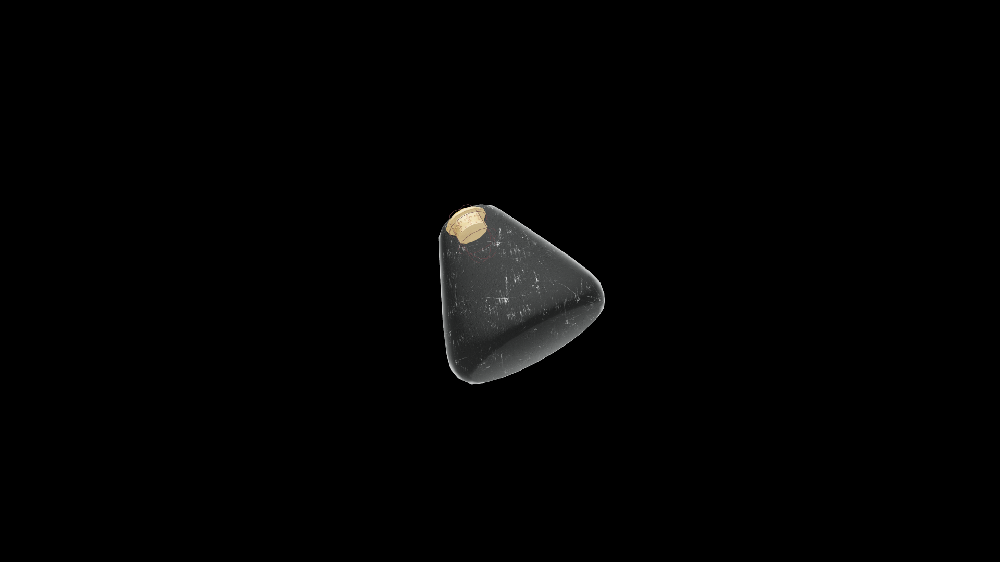

# Weak Potion Of Restore Personality

A soothing potion that restores calm and presence. It renews self-assurance and ease in speech, allowing the drinker’s natural charm and confidence to return.

## Item stats

  
Item stats

  <table>
    <tr><th>Weight</th><td>1.0</td></tr>
    <tr><th>Value</th><td>25. 0</td></tr>
  </table>

## Magic Effects

  
Magic Effects

  <ul>
    <li><a href="../../../Gameplay/MagicEffects/RestorePersonality/">Restore Personality</a></li>
  </ul>

