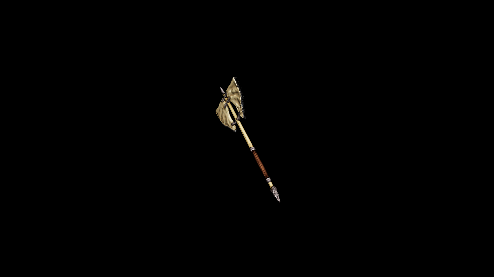

# Bone Battle Axe

This weapon is more than a tool of war. It’s a symbol of domination over nature and foe alike

## Item stats

  
Item stats

  <table>
    <tr><th>Weight</th><td>34.4</td></tr>
    <tr><th>Value</th><td>829</td></tr>
    <tr><th>Damage</th><td>13</td></tr>
    <tr><th>Skill</th><td><a href="../../../../Skills/Axe/">Axe</a></td></tr>
    <tr><th>Damage Type</th><td>Physical</td></tr>
    <tr><th>Holster Slot</th><td>Back</td></tr>
    <tr><th>Two Handed</th><td>Yes</td></tr>
    <tr><th>Weapon Set</th><td>Bone</td></tr>
  </table>

