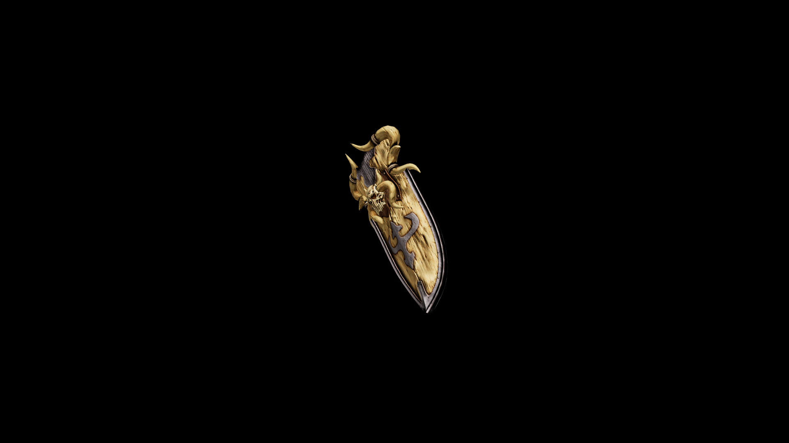

# Bone Great Shield

These grim shields are often the mark of a master grafter. They take such pride in the crafting of this gear, that they inscribe the names of all craftsmen that contributed into various parts of the shield.

## Item stats

  
Item stats

  <table>
    <tr><th>Weight</th><td>33.1</td></tr>
    <tr><th>Value</th><td>408</td></tr>
    <tr><th>Damage</th><td>6</td></tr>
    <tr><th>Skill</th><td><a href="../../../../Skills/Block/">Block</a></td></tr>
    <tr><th>Damage Type</th><td>Physical</td></tr>
    <tr><th>Holster Slot</th><td>Hip</td></tr>
    <tr><th>Two Handed</th><td>No</td></tr>
    <tr><th>Weapon Set</th><td>Bone</td></tr>
    <tr><th>Shield Type</th><td><a href="../../../../Gameplay/ShieldTypes/#great-shields">Great</a></td></tr>
  </table>

